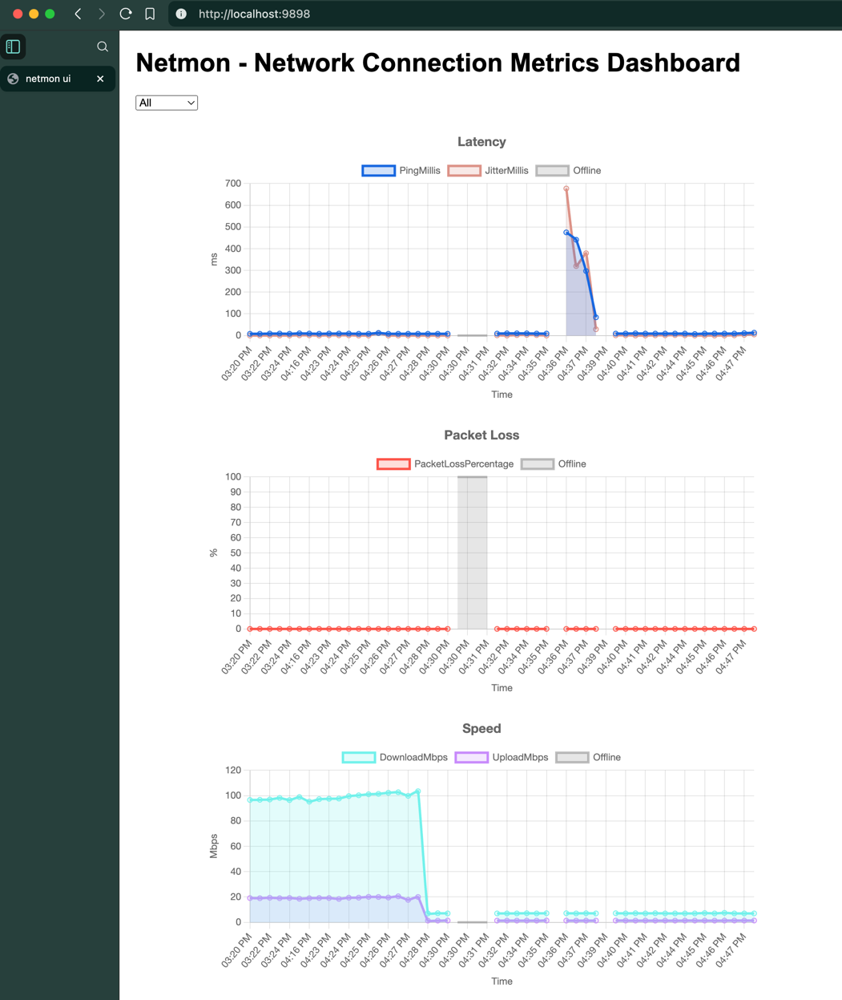

# netmon



**netmon** is a simple network connection latency & speed monitor.

- **Single binary**, no dependencies
- **Cross-platform** (Linux, macOS, Windows)
- **Minimalist**, no configuration, no setup, no installation
- **Periodically** checks network connection latency & speed
- Stores results in an **SQLite** database
- Provides a simple **web interface** to view results as visual charts
- Supports both running in **standalone** mode and installation as a **system service**

## Installation

- **Option 1:** Download and extract the latest
  release: [Releases](https://github.com/mmdemirbas/netmon/releases)

- **Option 2:** Build from source:

   ```bash
   git clone https://github.com/mmdemirbas/netmon.git
   cd netmon
   task build
   ```
  To see all available commands, run `task --list`.

## Usage — Standalone

1. Run the binary.
   ```bash
   ./bin/netmon
   ```

2. Open the web interface at [http://localhost:9898](http://localhost:9898).
3. To stop, press `Ctrl+C`.

- If you cloned the source code, you can also use the task commands:
    ```bash
    task run    # run in foreground
    task start  # run in background
    task stop   # stop
    ```

## Usage — System Service

1. Install and start the service.
   ```bash
   task install
   ```
   or
   ```bash
   sudo ./bin/netmon -service install
   sudo ./bin/netmon -service start
   ```
2. Open the web interface at [http://localhost:9898](http://localhost:9898).
3. Stop and uninstall the service.
   ```bash
   task uninstall
   ```
   or
   ```bash
   sudo ./bin/netmon -service stop
   sudo ./bin/netmon -service uninstall
   ```

## Configuration

| Flag              | Description                                                 | Default          |
|-------------------|-------------------------------------------------------------|------------------|
| `-db-file <path>` | Path to the SQLite database file.                           | `data/netmon.db` |
| `-interval <s>`   | Interval between checks.                                    | `5m`             |
| `-port <n>`       | Port for the web interface.                                 | `9898`           |
| `-service <s>`    | Control service (`install`, `start`, `stop`, `uninstall`).  |                  |

## Contributing

See [CONTRIBUTING.md](CONTRIBUTING.md).

## Author

Muhammed Demirbaş - [GitHub](https://github.com/mmdemirbas)

Thanks to the following open-source projects:

- [Go](https://go.dev/)
- [speedtest-go](https://github.com/showwin/speedtest-go)
- [Chart.js](https://www.chartjs.org/)
- [go-sqlite3](https://github.com/mattn/go-sqlite3)
- [service](https://github.com/kardianos/service)
- [Task](https://taskfile.dev/)

## License

This project is licensed under the MIT License - see the [LICENSE](LICENSE) file for details.
